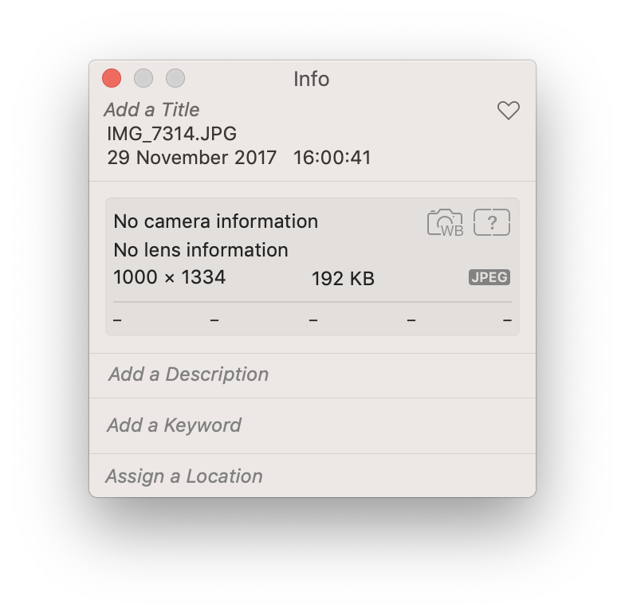
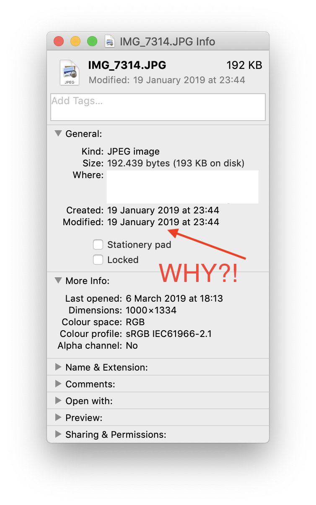
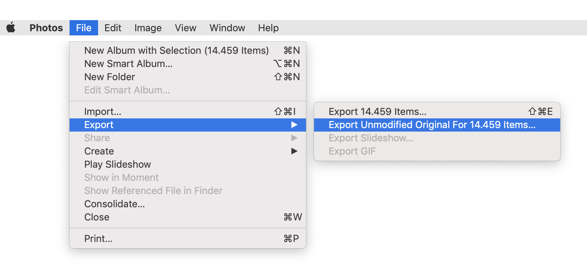

# Apple Photos - Export timestamp fix

When exporting unmodified originals from Apple Photos the timestamps can be wrong.
Sometimes this information is still available within the photo EXIF data, but
sometimes you're not that lucky and the one and only date is wrong.

| Info Apple Photos  |  Info Finder |
| ------------- | ------------- |
|  |  |

---

This script fixes these cases by copying the time information from Apple Photos 
into the photo EXIF data.

## Getting started

1. Clone the project to your Desktop
```
$ git clone https://github.com/mvgijssel/apple-photos-export-timestamp-fix.git ~/Desktop/apple-photos-export-timestamp-fix
```

2. **Copy** your Apple Photos library to the folder (mostly located in `~/Pictures/`)
```
$ cp ~/Pictures/'Photos Library.photoslibrary' ~/Desktop/apple-photos-export-timestamp-fix/library
```

3. Export unmodified originals from Apple Photos and save into `~/Desktop/apple-photos-export-timestamp-fix/images`

 

4. Run this script
```
cd  ~/Desktop/apple-photos-export-timestamp-fix
$ fix_my_timestamps images/ fixed_images/
```
