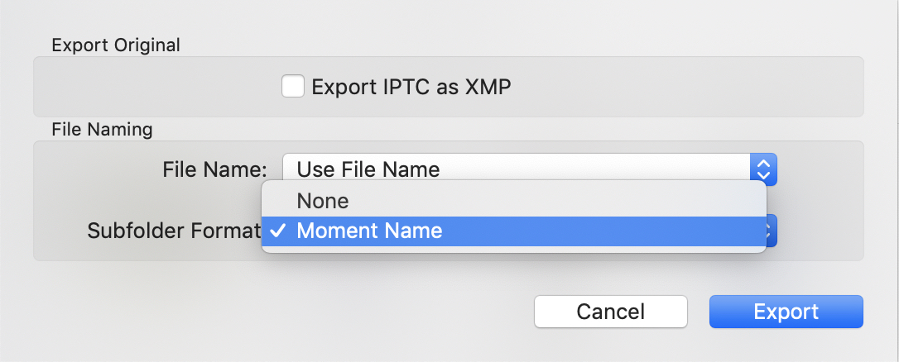

# Apple Photos

When exporting unmodified originals from Apple Photos the timestamps can be wrong.
Sometimes this information is still available within the photo EXIF data, but
sometimes you're not that lucky and the one and only date is wrong.

| Info Apple Photos  |  Info Finder |
| ------------- | ------------- |
|  |  |

---

This script fixes these cases by copying the time information from Apple Photos 
into the photo EXIF data.

## Getting started

1. Clone the project to your Desktop
```
git clone https://github.com/mvgijssel/apple-photos-export-timestamp-fix.git ~/Desktop/photofix
```

2. Export unmodified originals from Apple Photos and save into `~/Desktop/photofix/images`

 

3. Make sure to export photos to their **Moment Name** subfolder

 

4. Run this script
```
cd  ~/Desktop/photofix
./photofix apple ./images
```

> NOTE: assuming the iCloud Photos library is located at ~/Pictures/Photos Library.photoslibrary

# Google Photos
When exporting photos from Google Photos the timestamps are not preserved within the photo EXIF data, this data is provided in a "sidecar" json file. 

## Fixing my timestamps

1. Clone the project, for example to your Desktop
```
git clone https://github.com/mvgijssel/apple-photos-export-timestamp-fix.git ~/Desktop/photofix
```

2. Navigate into the installation directory
```
cd ~/Desktop/photofix
```

3. Install all the dependencies
```
brew install exiftool
bundle install
```

4. Export Google Photos using https://takeout.google.com/settings/takeout 

> Depending on the number of photos you have, the photos will need to be downloaded in 
multiple archives. Try to make the archives as large as possible (50GB), smaller archives can 
miss necessary json information.

5. Move all the .zip archives to a single folder: `~/Desktop/photofix/images`

6. Navigate to the images folder
```
cd ~/Desktop/photofix/images
```

7. Unzip all the archives using the following command 

```
for file in $(ls); do; echo "Processing $file"; unzip $file -d "unzip-$file"; done
```

8. Merge all the unzipped folders
```
mkdir merged
for folder in $(ls | grep "unzip-"); do; echo "Merging $folder"; cp -R $folder/Takeout/Google\ Foto_s/* merged/; done
```

9. Remove the unzipped folders
```
for folder in $(ls | grep "unzip-"); do; echo "Removing $folder"; rm -rf $folder; done
```

10. Navigate to the installation directory
```
cd ~/Desktop/photofix
```

11. Run script to fix google photo timestamps and export to `~/Desktop/photofix/final`
```
./photofix google ~/Desktop/photofix/images --dest ~/Desktop/photofix/final
```
